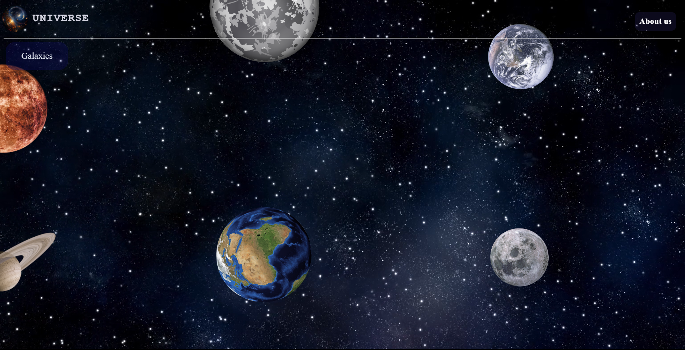

# UNIVERSE PROJECT

## TABLES
- galaxy table
- solar system table
- planet table
- details table

## inspiration
### i just love universe, space, the shape of galaxies, planets and system of solar system, so i just decided to create a web site for it.
### so i just did a simple page of galaxies that have some solar systems and each solar system has some planets.

## Technology & Architecture
### when you open the page you will see Galaxies Button click on it to see galaxies and when you click on any galaxy of them you gonna see the solar systems of this galaxy and click on any of them you gonna see the planets of this solar system you have clicked and whenever you click of any of what i mentioned you will able to see “See Details” Button this button take you to see some details about what did you selected

## Algorithms
### I managed to control database of my project by python functions and using flask framework for API and ending data to html file to show on frontend

## ./run.py -> for running the project

### Universe project is project to see the universe by easiest way like you can see list of galaxies each one has solar systems and each solar system has planets and you can see details about any of them by select it and click see details button => [Universe](http://100.25.19.252/)
